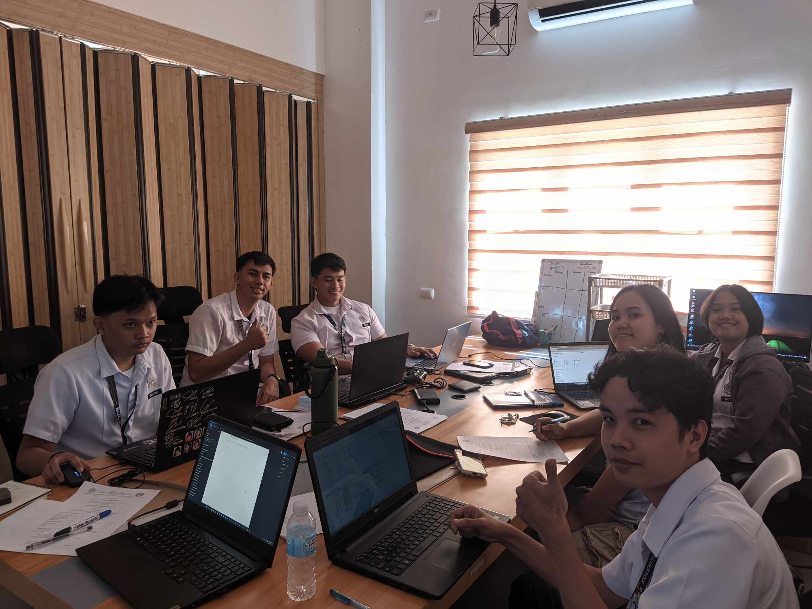

[Next (Feb 6)](./02-06-2024.md)

# First Day of the "On The Job Training"

The establishment I was deployed is named **"Sili Deli"**, they are considered as a
technology business incubator that helps startup companies which uses modern technology
for innovation. They are funded and initiated by DOST according to their [facebook](https://www.facebook.com/silideli/)
page. They can be found in **OSAS Bldg, Bicol University - Main Campus, Legazpi City, Albay**.

 

## Meet the Team

That's me at the bottom right of the photo with a thumbs up. We are 7 BSIT students, all
of them are in Block C while I'm in Block A. I was recruited by my friend Marriane, the
girl in the far right side of the photo.

 

## First Day Activities

The first goal of the day is the collection of each member's "Letter of Acceptance" and
CV/Resume on which will be given to our supervisor. I might be late when it comes to the
processing of the required documents because I'm following the phase of my Block C
teammates. But our supervisor already agreed to accept us as their intern which happened
last February 2, 2024 which is Friday and was conducted at the **BU Center for Technology
Commercialization and Enterprise Development** located at the **BU College of Engineering
Campus**. We met and greeted the directory **Dr. Arnulfo P. Malinis** and the staffs in
the department.

After the collection of each member's Letter of Acceptance and CV, we started to discuss
the additional features that we will implement to the system that we are tasked to
improve. I was assigned at the back-end side of the development, which means i will handle
the system's database and server improvements and maintenance. The assigned role is fine
for me, I have a good amount of technical experience when it comes to handling things
like that.

While the development phase for the new features have not yet started, I have a good amount
of time to study the system's existing database, because I was also tasked to apply
proper index referencing or applying foreign keys to optimize the system's database schema.
This is a major task that requires coordination to the members because the back-end is
the foundation of the system, a small change can affect any front-end stuff that relies on
it. That's what I did for the rest of the day, while also listening to the team discussions.

 

## Final Thoughts

The weather is hot, and more days will come with this kind of weather as expected for a
country located near the equator. I hope I will have the patience to endure this weather
and this training, for this is only the beginning. I look forward to the things to learn
and the opportunities to grow as an individual.
