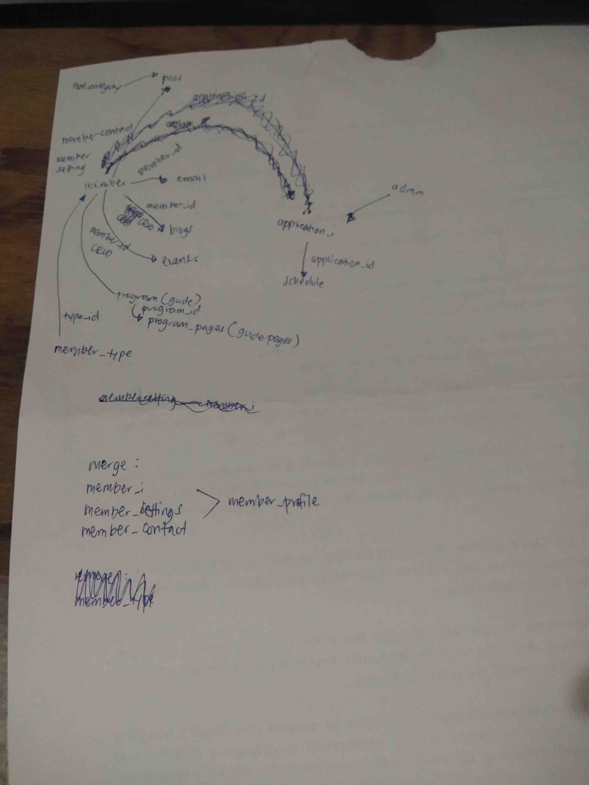

# 2nd Day of "On The Job Training"

The beginning of every endeavors often presents a challenge, being either the toughest
hurdles or a pool of enthusiasm. For me, the second day falls into the latter category.
This sense of excitement is particularly potent at the initial phase of this journey,
perhaps because I find myself still navigating the learning curve, where the novelty of
the experience has yet to wear thin. We'll see...

 

## Activities Performed

Upon starting my workday, my initial focus gravitated toward optimizing and revamping the
project's database. A thorough analysis of the current system's database revealed several
areas in need of improvement, prompting the decision to overhaul the schema. Consulting
with my teammate, who also oversees the back-end aspect of the system, proved fruitful as
he agreed with the proposed changes. Despite this positive collaboration, a lingering
concern emerged—I hope my colleagues don't hold overly high expectations for me. I prefer
to navigate my responsibilities without the weight of undue expectations. This things are
probably normal, that's why we can hear about individuals who got fired in their working
establishments because they did not meet their expectations.

 

In my attempt to conceptualize the system's schema and implement potential changes, I
found myself immersed in scribbled notes. Visualization of the proposed alterations became
clearer through discussions and clarifications with reliable teammates. I extend my
gratitude to the creators and developers of indispensable tools, namely [vim](https://www.vim.org/),
[fzf](https://github.com/junegunn/fzf), and [grep](https://en.wikipedia.org/wiki/Grep),
which played a pivotal role in aiding my analysis.

 

## Final Thoughts

The weather is simply perfect – not too hot, partly cloudy, and accompanied by a gentle
breeze. These simple joys elevate the day, creating an atmosphere that adds to the overall
positivity.
