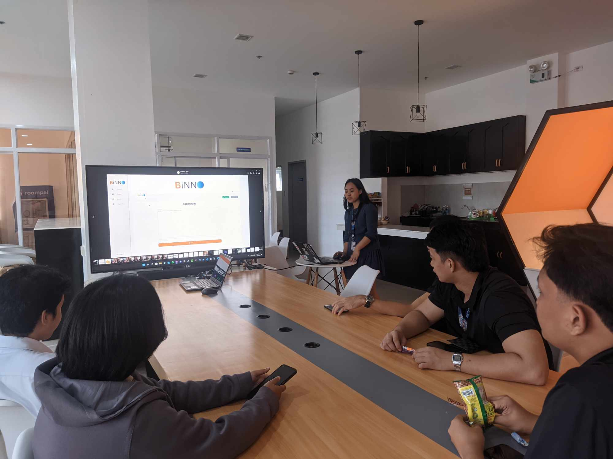

[Previous (Feb 6)](./02-06-2024.md)

[Next (Feb 8)](./02-08-2024.md)

# 3rd day of On The Job Training

Today marked a series of significant events that shaped our journey – the inaugural formal
meeting, the submission of our application for a medical certificate, and the inception of
the initial Entity-Relationship Diagram (ERD). Each milestone contributes to the unfolding
narrative of our progress, reflecting the commitment and dedication embedded in our
collective efforts.

 

## The team's first formal meeting

Our inaugural meeting centered around refining and clarifying the User Interface (UI) and
User Experience (UX) of the system. Despite the predominant focus on aspects not directly
aligned with my expertise in back-end development and database management, I actively
participated in the discussion. Skipping the meeting wasn't an option, as it provided
valuable insights into the overall flow and processes of the system. The meeting extended
for approximately one and a half hours, during which I gained a deeper understanding of
the project's dynamics.

 

## Medical Certificate

Obtaining the medical certificate turned out to be a relatively straightforward process.
Personally, I find crowds overwhelming, and witnessing a sea of students lining up was a
bit daunting for me, possibly influenced by the two years of quarantine isolation. As the
first batch to undergo online classes, adapting to the traditional on-site procedures felt
like a novel experience.

Fortunately, the processing was efficient, especially for OJT students who had a separate
line. The only test required for the certificate was checking blood pressure, a quick and
straightforward procedure. I'm pleased to report that the test went smoothly, and my blood
pressure results came back within the normal range. After that I finally received my
medical certificate.

 

## Final Thoughts

I've made a conscious decision not to delve into the specifics of the system's initial
Entity-Relationship Diagram (ERD) design. While it represents a significant personal
milestone in my journey, certain details must remain private to protect the system's
integrity and security. As an Information Technology student, I recognize the importance
of exercising caution and understanding the potential risks associated with sharing
sensitive information on the internet. Respecting these boundaries is a fundamental aspect
of responsible and ethical technology practice.

The day has been fantastic, and I find myself in harmonious terms with my teammates. I
sincerely hope that this positive camaraderie endures throughout the duration required to
fulfill our OJT hours. Regardless of the inherent stress that may accompany our roles,
being surrounded by a supportive and cohesive team makes every challenge more manageable.
Here's to hoping that days like this continue to grace our journey, reaffirming that with
a good company, everything falls into place.
