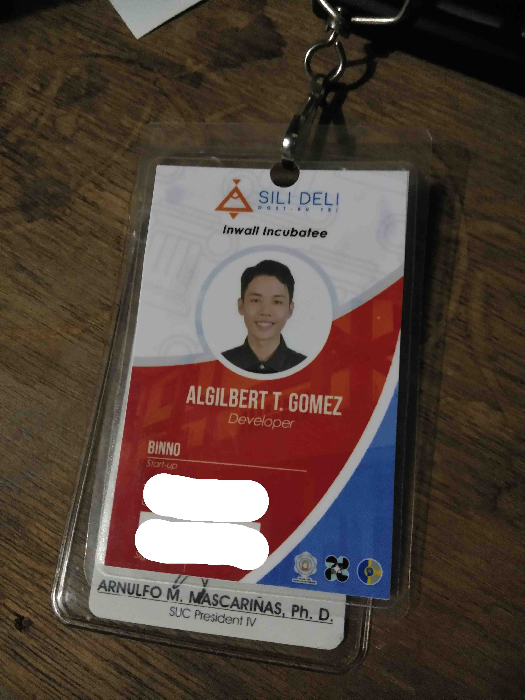
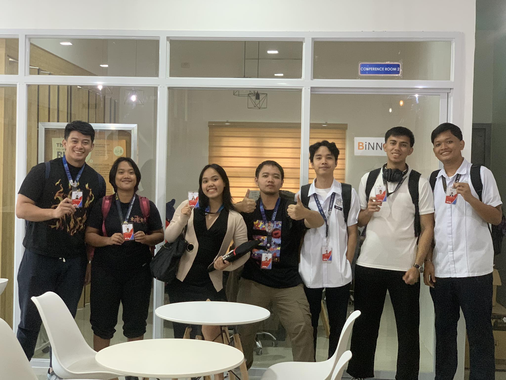

[Previous (Feb 7)](./02-07-2024.md)

[Next (Feb 12)](./02-12-2024.md)

# 4th Day of On The Job Training

Today has been enjoyable, and the team is operating smoothly. To sidestep the scorching
midday sun, I've started packing my own lunch. The frustration arises from the seemingly
unreasonable costs of meals outside, consistently exceeding thirty pesos. I've set an
expectation that a hundred pesos should cover three days of lunch expenses. While some
might label it as frugality, the idea of spending more just feels a bit absurd to me.
It might sound pessimistic, but the reality is that things seem to keep getting more
challenging.

 

## Activities Performed

Today, I successfully translated the Entity-Relationship Diagram (ERD) I devised yesterday
into MySQL query format. While the structure is pending approval from my fellow back-end
teammates and other developers, this marks a significant milestone for me in the realm of
back-end development. The process has been quite fulfilling, and I find great satisfaction
in handling database queries. The work, in essence, aligns seamlessly with my skills and
preferences in the back-end side of development.

 

## OJT establishment ID

Today, I received my establishment ID, and it's a tangible symbol that I truly belong to
this workplace. It exudes a sense of prestige, akin to a badge of professionalism that
solidifies my identity within the organization. This small yet significant token adds an
extra layer of connection and authenticity to my experience in the workplace.

 

## Team Photo

Now that each of us has our own ID, we collectively decided to capture the moment by
taking a picture together. This gesture not only serves as a documentation of our
individual presence but also fosters a sense of camaraderie and solidarity within the
team. It's a visual representation of our shared journey and a reminder of the unity that
binds us as colleagues.

That's me, the third guy from the right. Unfortunately, I forgot to strike a pose as I'm
not particularly comfortable in front of cameras. Despite my lack of modeling finesse,
the camaraderie and shared experience captured in the photo make it a memorable moment
nonetheless.

 

## Final Thoughts
Indeed, there are still many days ahead, and we are far from the end of our journey.
The road ahead promises not only continued technical learning but also personal growth.
Embracing the ongoing opportunities for development, both professionally and personally,
adds an exciting and enriching dimension to our collective experience. Here's to the
journey ahead and the multitude of lessons awaiting us on this path of growth.
