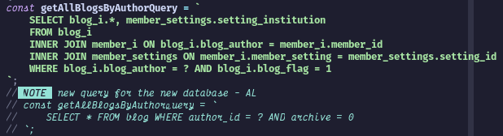

[<- Previous (Feb 12)](./02-12-2024.md)

# 6th Day of On The Job Training

This day is magnificent, the weather is great. Not too hot, windy, and with a little bit
of rain shower. For me, that is the perfect day. I believe that perfect weather makes up
the whole day. I once read a book on why Filipino people were considered lazy according
to the Spaniards back in the day. One of the reasons is because of the hot weather. That's
probably because Filipinos back then worked in the fields. I may not be working in the
fields, but I kinda feel for them if that was true.

 

## Activities Performed

I started delving into the project's back-end code. I began converting the SQL queries to
fit the new database I designed. I'm not finished yet, so I will leave the rest for
tomorrow. I need to treat this matter as a job, which means I should think that they are
not paying me if I take some of the work home.

Here is a code snippet sample. I commented it out first to make sure that I will not
disrupt any crucial operations yet. I just need to make sure that the integration for the
new database is ready. Look at how simple my query is for the new database, the old
database needs a lot of table joining just to verify the integrity of the needed data.

That's what I did for the whole day or the whole time I was timed in.

 

## Final Thoughts

I cooked my own lunch meal for the day at the cost of being late for 30 minutes. It's fine
by me. You know, gotta adjust to the new routine, especially when you started preparing
and cooking your own lunch. It has its own perks; I did not spend a great amount of money
just for a lunch meal. Just need to make sure I brought a lot of rice.
