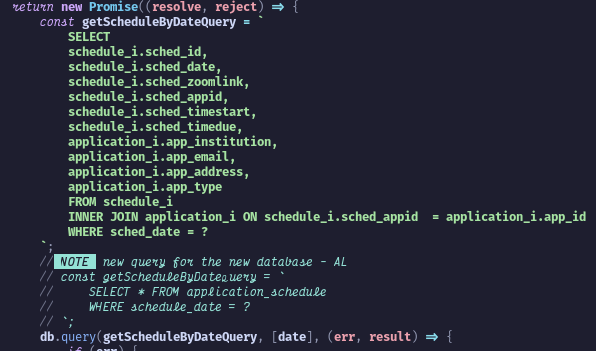

[Previous (Feb 13)](./02-13-2024.md)

[Next (Feb 15)](/02-15-2024.md)

# 7th Day of On The Job Training

Today is Valentine's Day, and it's not that exciting because I don't have a special girl
in my heart right now. A man's got priorities, and romance is not within the scope yet.
Valentine's Day is just a normal day; you can still show your affection to your special
loved ones on a regular basis. Or maybe I just don't have money to buy chocolates and
flowers or take a girl on a date; the expensive lunch meals are to blame here.

 

## Activities Performed

The activities I performed today are the same as yesterday, involving the conversion of
old SQL queries to newer ones that will utilize the new database I created. Below is a
sample code snippet. The situation remains consistent with yesterday, where the old query
requires extensive table joining to verify the integrity of the retrieved data. I have
commented out the new query I created to ensure it does not disrupt any crucial operations
at the moment. I just need it to be ready when the integration for the new database is
complete.

 

## Final Thoughts

The day ended well even though I didn't have a girl to spend Valentine's Day with. The
good thing is when I bought my lunch meal, there was a free small chocolate from the
store. It made my day a little better. After all, I'm just a guy whom only a few people
truly appreciate.
