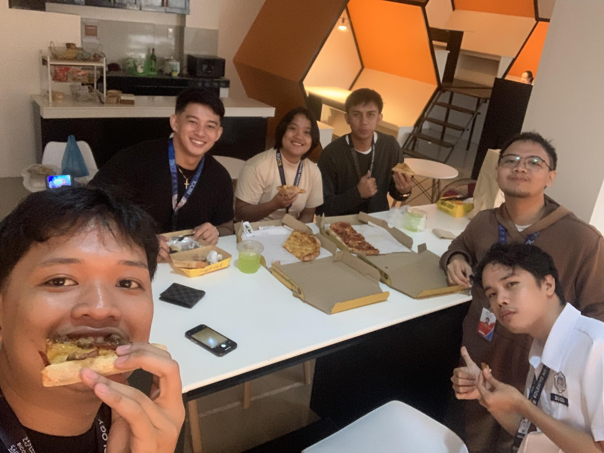

[Previous (Feb 14)](./02-14-2024.md)

[Next (Feb 16)](./02-16-2024.md)

# 8th Day of On The Job Training

Today is the aftermath of Valentine's Day. Nothing much happened to me yesterday except
I slept early, which is why today I got a complete 8 hours of sleep. I feel great; the
weather is cold and rainy. Just another perfect day to do some OJT work, which is to stare
at the screen for the majority of the day.

 

## Activities Performed

Today, out of boredom, I started reading the codebase for the front-end side of the
system. I'm trying to understand or study the structure of the data that is being sent to
the server's back-end API. After years of reading code, I easily grasped it even though
I'm not well-versed in the tools used to develop the front-end code. After all, when you
have enough experience in the field, you just develop an ability to sense patterns. I
thank the front-end team for putting in the effort to make the codebase readable.

Also, one of the team members had their birthday today. Lucky guy, a birthday after
Valentine's Day. The team shared two pizzas, which is nice. After that, I ate my packed
lunch, which means I'm full.

Because I'm full, and the weather is nice and cold, I felt sleepy, so I took a quick nap.
According to Japan, sleeping in the workplace is an honorable thing; that's why they have
sleeping booths in their companies. So, by Japanese standards, what I did is fine. After
all, I guess I've done my fair share of work.

 

## Final Thoughts

It's a great day, can't say anything more.
