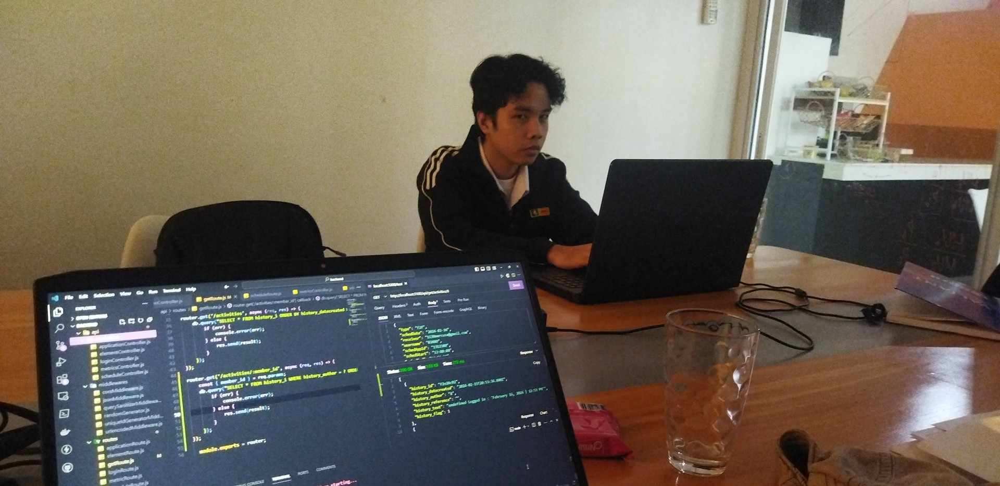

[Previous (Feb 15)](./02-15-2024.md)

[Next (Feb 19)]()

# 9th Day of On The Job Training

Today is a very confusing day because there's an event in Daraga, and our establishment
is kinda borderline between Daraga and Legazpi. There's confusion about whether we are
included in the holiday or not, especially since the College of Arts and Letters behind
us doesn't have classes. When there's confusion, especially early in the morning, it's
kinda hard to get out of bed; after all, all you need to do is choose between the two
choices. Anyways I chose to still come to work just to avoid the household
responsibilities.

 

## Activities Performed

I started creating the API endpoints that are needed for the system's new features, which
are the FAQ (frequently asked questions) and UAQ (user asked questions). Since these
features are new, they will now utilize the new database schema that I created. It is a
step that will initiate the migration of the system from the old to the new database.

That's me, staring at the laptop screen, while noticing that one of my teammates took a
picture of me. In case you're wondering, all my photos in this blog are in the third
person point of view. That's because I never liked using or being exposed to the camera
that much.

 

## Final Thoughts

It's a quiet day; due to the confusion of events, we're only two in the office.
