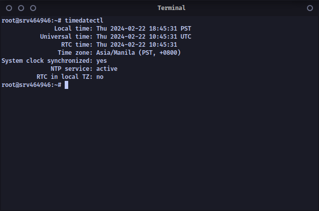

[Previous (Feb 19)](./02-19-2024.md)

[Next (Feb 21)](./02-21-2024.md)

# 11th Day of On The Job Training

Today is Tuesday.

<br>

## Activities Performed

Today, I improved our system's database and ERD model. We determined that our system is
lacking in terms of data statistics. For example, data visualizations using a line graph,
etc. So, I created another table in our database that will be utilized by our new data
statistics feature. The functionality is simple: just count how many content is being
created every day.

I also updated our VPS's timezone because we're having problems storing accurate
Philippine time in the database. For example, when storing the values of the ```NOW()```
function in MySQL, the expected value is wrong.



Also, I updated our VPS because updating software is a must in order to get their latest
patches for vulnerabilities. Updating Linux is much better than Windows. I don't know why
Windows updates are annoying or invasive, but in Linux, it's much easier. Updating the VPS
is a nerve-wracking experience because there might be complications afterward, and I am to
blame for it.

<br>

## Final Thoughts

The introduction is getting shorter. Well, that's because there are times when our sense
of creativity is falling short. After all, I'm writing this blog after work, where our
minds are getting tired, and we just want to get to the point of things. That's why when
persuading someone, make sure that their mind is tired, and their ability to make a
decision is being affected negatively.
