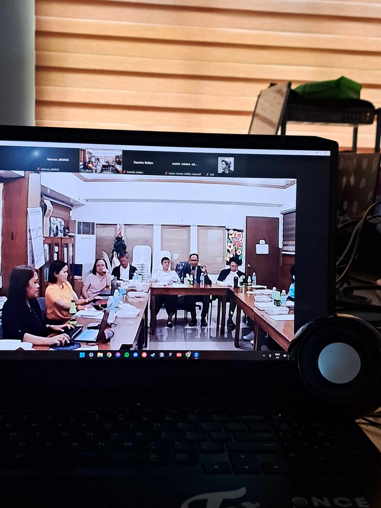

[Previous (Feb 21)](./02-21-2024.md)

[Next (Feb 23)]()

# 13th Day of On The Job Training

Since yesterday, I cannot wear casual civilian attire, I decided to wear civilian attire.
Thankfully, our workplace is not that strict when it comes to the dress code. Probably as
long as I'm fully clothed because our office is cold. And probably just have a sense of
decency.

 

## Activities Performed

Today, I created a module or reusable code that handles the incrementation of the content
statistics every time a piece of content is being created based on the current day. For
me, it's a simple addition to our system's codebase.

In the afternoon, our team attended a Zoom meeting hosted by the Department of Trade and
Industry (DTI). The topic was about technology startups here in Bicol. They discussed the
issues faced by startup companies, particularly the challenge of not knowing how to
register as a startup. This lack of clarity leads to many startups being neglected,
which is a significant waste, especially if a startup's idea or vision could be beneficial
to the community.

 

## Final Thoughts

Today is a fine day. Nothing bad happened which is a good thing.
