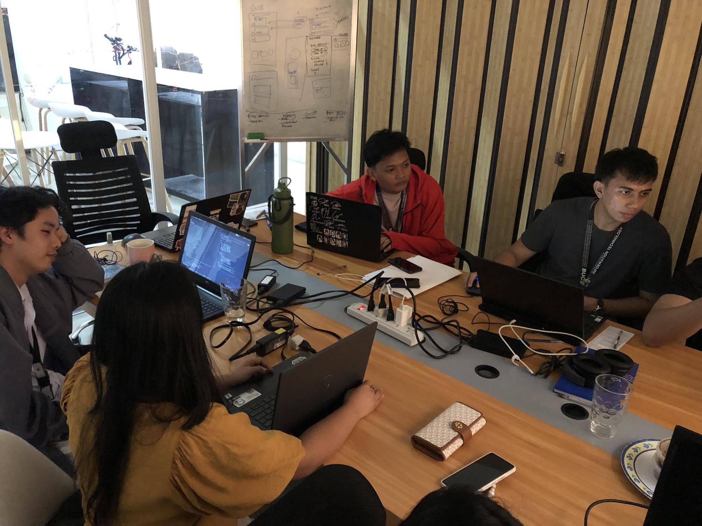

[Previous (Feb 22)](./02-22-2024.md)

# 14th Day of On The Job Training

Thank God It's Friday! I now consider myself a working man, so weekends are such a treat.
Friday is when the body is starting to rejoice because they can finally have time to do
our recreational activities after a stressful week. I decided to wear a uniform because
wearing casual civilian wear looks fashionable, but it is a pain to have a lot of clothes
to do the laundry. Not to glorify the Nazis during World War 2, but I admit their officers
looked dashing in their uniform. So for me, wearing my uniform feels the same way.

 

## Activities Performed

Today, I created a POST request endpoint in our system's API. The purpose is to implement
functionality that enables a user to pin a post so that they can view that post at the
top of their feed. With the help of my fellow back-end programmer, the job is easy enough.

Here is a picture of our "busy moment". That's me at the far left of the picture.

 

## Final Thoughts

The internet in our workplace is slow and most of the time unstable. This is one of the
challenges we are facing, especially if our system is taking advantage of cloud services.
I fear that we might finish our OJT without experiencing a fast and stable internet
connection in our workplace.
