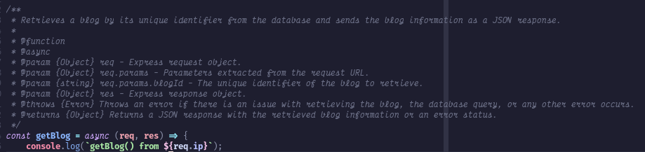
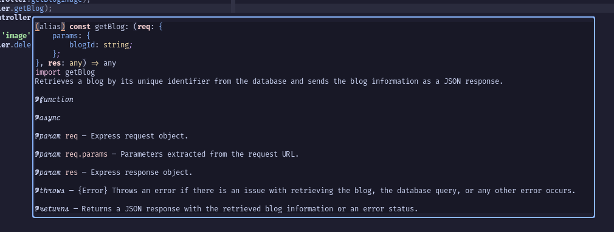

[Previous (Feb 28)](./02-28-2024.md)

[Next (Mar 1)](./03-01-2024.md)

# 18th Day of On The Job Training

Today is the last day of work from home. Pretty excited to go back to the office. I
started to like the office. There are a few simple reasons. First, according to some
social studies or some article I've read too long ago, a town is happy if they know all
the individuals inhabiting it. That's probably my case too because we are a small team.
Lastly, the ambiance is nice.

 

## Activities Performed

I discovered the existence of JSDoc. JSDoc is a markup language used to document or
annotate JavaScript source code files. I told myself, "That looks neat!" So I decided to
apply it to the back-end code for our blog feature.

Here's a sample code snippet.

So now when I decided to hover that function to where it was referenced this will show up.

I hope this improves the code readability for my fellow back-end programmers in my team.
If not, then it's fine. At least, what I'm doing is a good practice, which is to properly
document the codebase.
