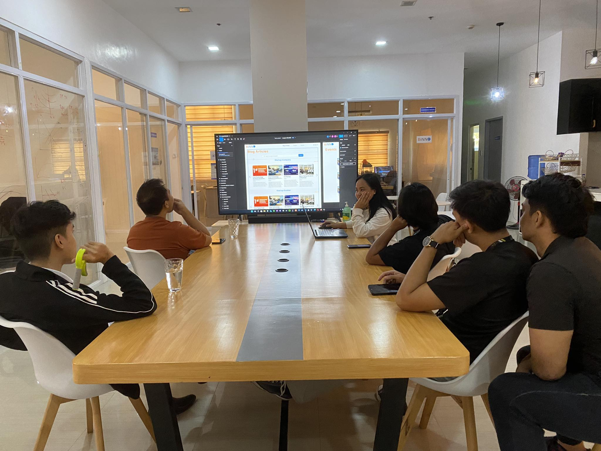

[Previous (Mar 6)](./03-06-2024.md)

[Next (Mar 8)](./03-08-2024.md)

# 23th Day of On The Job Training

Today we had a team meeting. This is to discuss the second phase of our development for
the BiNNO system. Since the original members have already defended their capstone project,
we can now proceed freely. The meeting is mostly about the system's user interface and
user experience, where a back-end developer like me cannot really be involved that much.

 

## Activities Performed

* Code refactoring.

