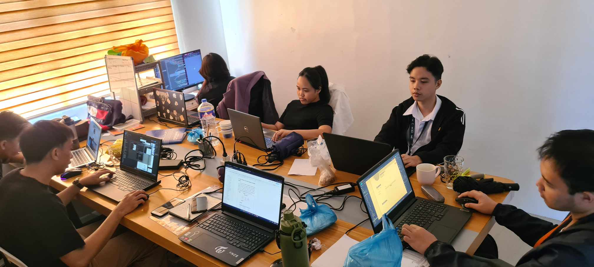

[Previous (Mar 11)](./03-11-2024.md)

[Next (Mar 13)](./03-13-2024.md)

# 26th Day of On The Job Training

That's me wearing the same jacket yesterday. Well there's no point in looking good.
There's no one to impress, just keep going until I can't anymore. But gosh, I look great
in my new haircut.

I can't write a longer blog again today, pretty tired mentally to be creative.

 

## Tasks Performed

Same as yesterday, code refactoring. It is because I'm pretty much ahead when it comes
to the tasks I was assigned. As a back-end all you need to think about is the logic of
the data processing, not making the website good looking. As a programmer who has a good
amount of experience, the tasks are getting too repetitive now.
